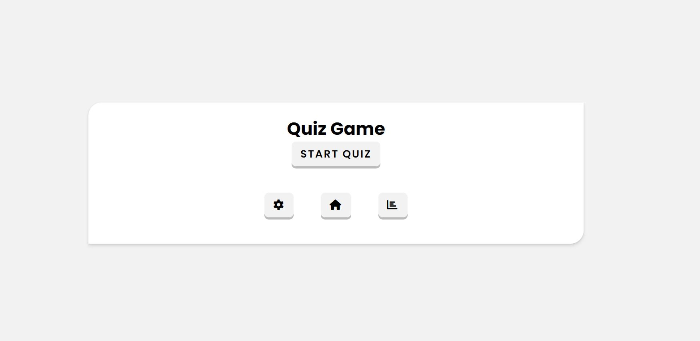
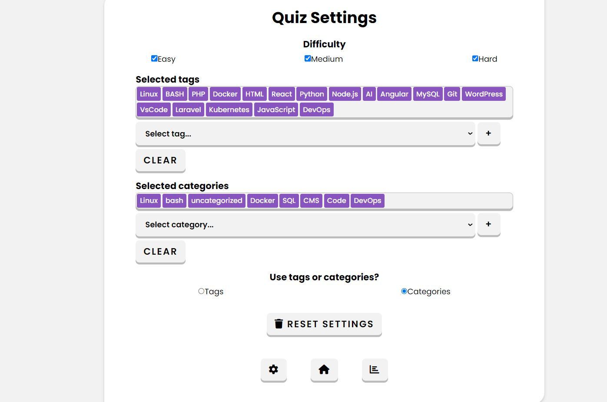
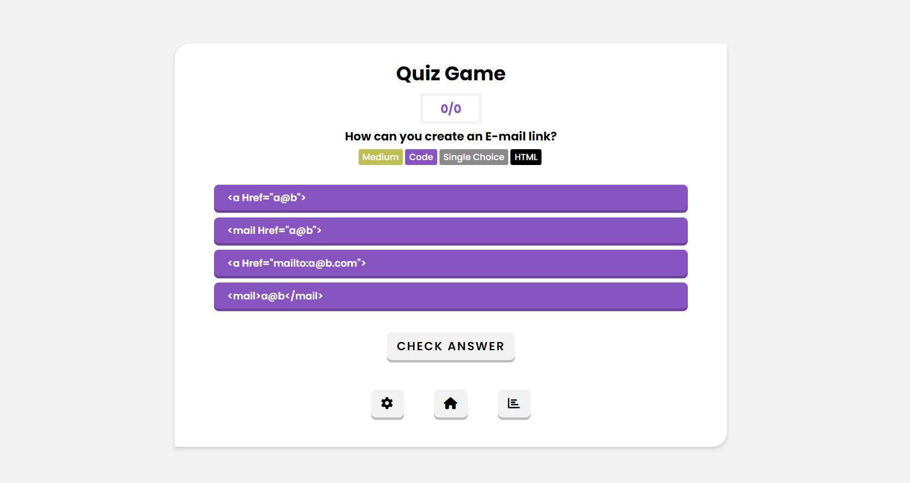
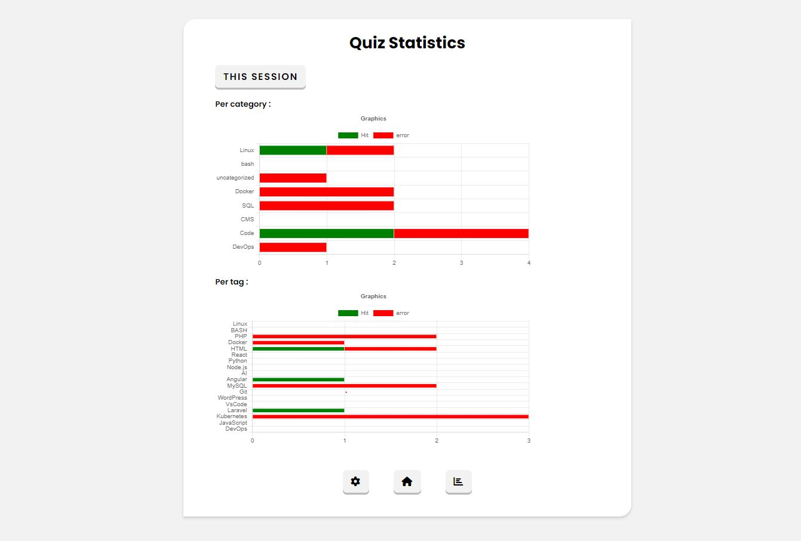

# Projeto: Consumindo uma API pública

Acesso: https://elc1090.github.io/project2-2024a-ivan-e-matheus/

### Desenvolvedores
Ivan Maidana da Silveira e Matheus de Almeida
Curso: Ciência da Computação

### Nosso produto

O nosso projeto se trata de um quiz, que permite que os usuários testem seus conhecimentos em uma variedade de tópicos relacionados a tecnologias. Algumas das funcionalidades principais incluem:

Perguntas do quiz são acessadas por meio de consultas a uma API, que fornece uma ampla gama de perguntas com várias categorias, tags e com diferentes níveis de dificuldade.

Personalização da Experiência: Os usuários têm a capacidade de personalizar sua experiência de jogo selecionando a categoria das perguntas, as tags associadas e a dificuldade desejada.

Análise de Desempenho: Além de fornecer perguntas de quiz, o site também oferece recursos de análise de desempenho. Os usuários podem visualizar gráficos que mostram seus acertos e erros por tag e categoria, permitindo que identifiquem áreas de força e fraqueza em seu conhecimento.

#### API escolhida

- [QuizAPI](https://quizapi.io/)

### Desenvolvimento

Substitua este texto por uma descrição do processo de desenvolvimento, explicando decisões tomadas e etapas do trabalho.
O desenvolvimento do projeto, se deu em algumas etapas e decisões foram tomadas para garantir a criação de um quiz funcional e intuitivo.

Primeiramente visitamos inúmeros sites, vídeos, imagens relacionadas a quizzes, para verificar como era a interface, a forma com que apresentavam as perguntas e opções de resposta. Posteriormente decidimos seguir o estilo que nosso quiz teria, semelhante ao de um vídeo citado, um pouco mais minimalista e sempre focando na usabilidade. Optamos por uma palheta de correr mais clara, a fonte principal sendo poppins, os ícones dos botões optamos por usar do site Font Awesome, e a biblioteca utilizada para os gráficos foi a chart.js.

A implementação da interface foi feita utilizando HTML, CSS e JavaScript. Isso envolveu a criação da estrutura HTML das páginas, a estilização dos elementos usando CSS para torná-los visualmente atraentes e responsivos, e a adição de funcionalidades interativas e dinâmicas utilizando JavaScript.

Para o quiz, foi necessário integração com a API que fornecesse perguntas e opções de resposta. Isso envolveu o uso de técnicas de requisição HTTP em JavaScript(fetch) para acessar os dados da API e exibi-los de forma adequada no site.

Para a página de estatísticas, foi utilizada a biblioteca Chart.js para criar gráficos que representam os dados de desempenho dos usuários em relação a cada tag e categoria.

#### Tecnologias

- HTML
- CSS
- Javascript
- chart.js (gráficos)
- Font Awesome (ícones)

#### Ambiente de desenvolvimento

- VS Code (Tema: Dracula Official)
- Extensões:
    Git Graph
    Live Server
    Auto Close Tag

#### Referências e créditos

- [QuizAPI Documentation](https://quizapi.io/docs/1.0/overview)
- [Quiz App Using Vanilla JavaScript | With Open Trivia DB API](https://www.youtube.com/watch?v=-cX5jnQgqSM)
- [Como implementar GRÁFICOS dinâmicos com Chart.js](https://www.youtube.com/watch?v=6TWv10m49nM&list=PLARhMvcrqcLyrPIEOTvyehxruw99BLiLD)
- [chart js](https://www.chartjs.org/docs/latest/)
- [ícones](https://fontawesome.com/)

---
Projeto entregue para a disciplina de [Desenvolvimento de Software para a Web](http://github.com/andreainfufsm/elc1090-2024a) em 2024a

